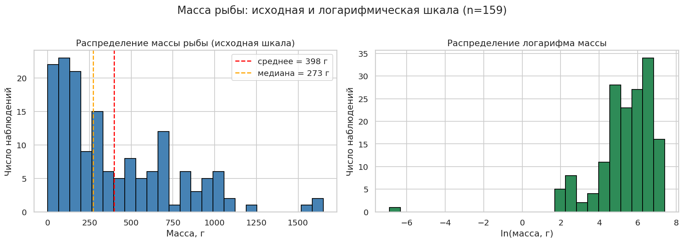
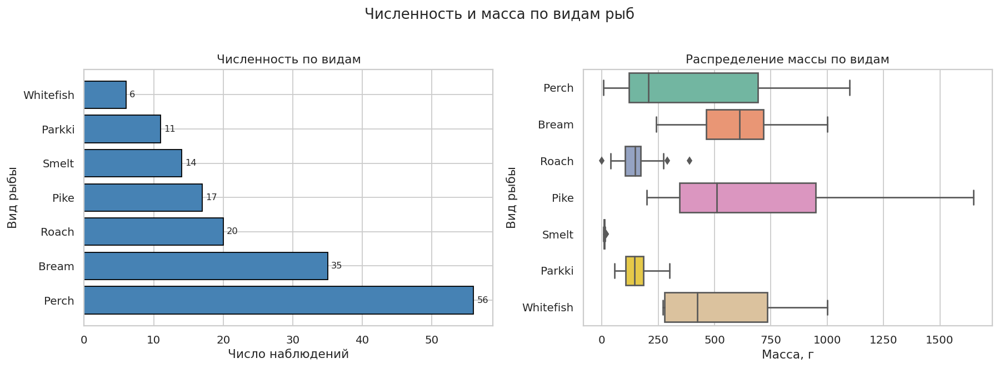
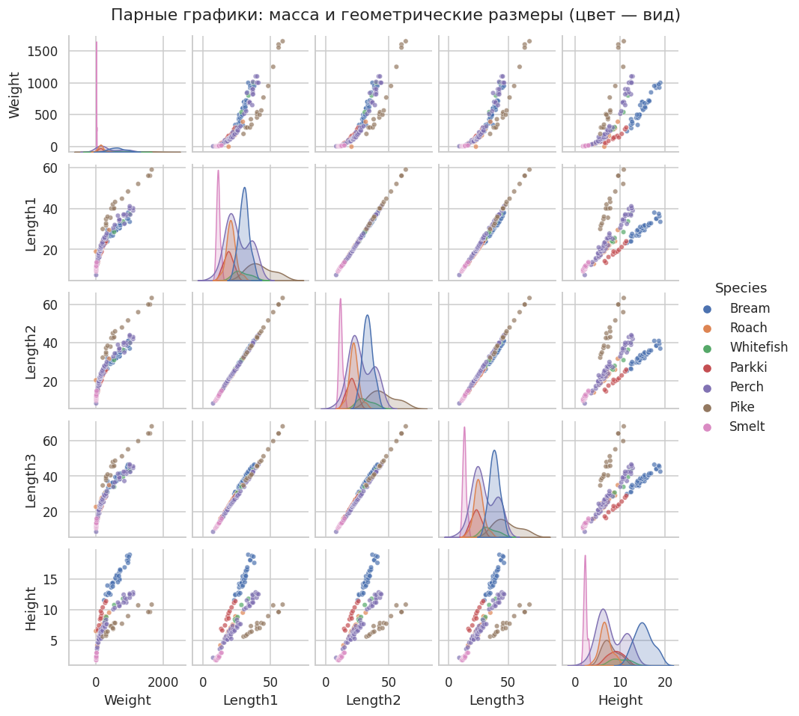
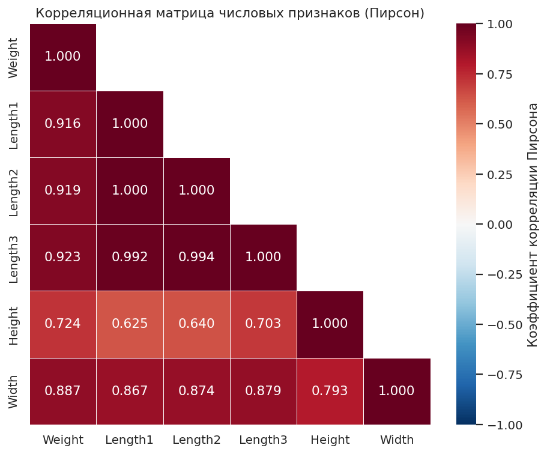
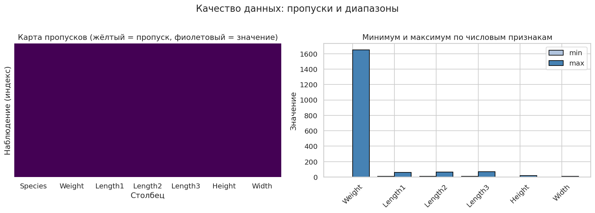
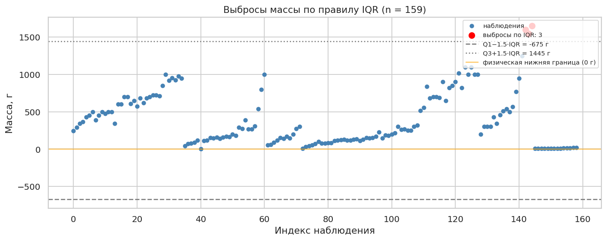
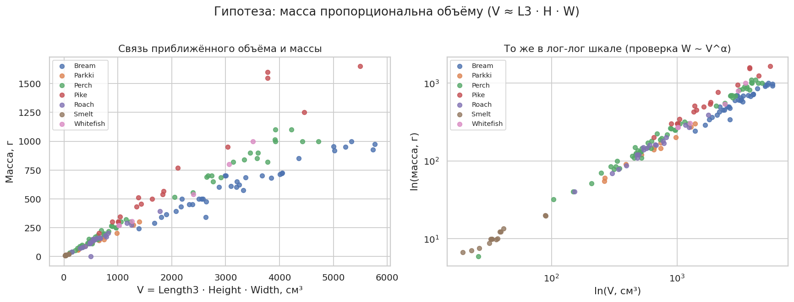

# Лабораторная работа №1. FishGrow: EDA

## 0. Паспорт воспроизводимости

| Параметр | Значение |
|---|---|
| URL исходного репозитория | https://github.com/tylerrussin/Fish-Dimensions-Regression-Analysis |
| URL форка (origin)        | https://github.com/ekovalen11/Fish-Dimensions-Regression-Analysis |
| Коммит (git rev-parse HEAD) | 1f65547b63c3043e2dcfff0c6435afa993331d4e |
| Дата клонирования | 2026-09-30 |
| Ветка | lab/01-eda |
| ОС | Ubuntu 24.04 |
| Python | 3.7.17 (pyenv, зафиксирован в .python-version) |
| pandas | 1.3.5 |
| numpy | 1.21.5 |
| dash | 2.1.0 |
| plotly | 5.6.0 |
| Команда запуска | `python run.py` |
| Результат запуска | приложение стартует, главная и /predict открываются в браузере |

## 1. Производственный контекст

Платформа FishGrow прогнозирует массу рыбы и контролирует качество
входных измерений. Целевая переменная — масса (Weight). Входные признаки —
геометрические измерения (длины, высота, ширина) и категория вида (Species).
Тестовая выборка остаётся закрытой до финальной проверки модели и на этапе
EDA не используется.

## 2. Отклонения от инструкции

Проблема: pipenv install --dev → "Python 3.7 was not found on your system".
Причина: в Pipfile зафиксирован python_version = "3.7"; в Ubuntu 24.04
         системный Python — 3.12, Python 3.7 отсутствует.
Решение: установлен pyenv и Python 3.7.17; в корне проекта создан
         .python-version (pyenv local 3.7.17); создано локальное venv
         через `python3.7 -m venv env`; pip откачен до <24.1;
         зависимости установлены из requirements.txt, полученного из
         Pipfile.lock.
Риск: версии транзитивных зависимостей могут отличаться от исходных;
      зафиксированы в reports/environment.txt.
### Форк репозитория (403 Forbidden при push)

При попытке выполнить `git push -u origin lab/01-eda` получена ошибка:

    remote: Permission to tylerrussin/Fish-Dimensions-Regression-Analysis.git
            denied to ekovalen11.
    fatal: «https://github.com/tylerrussin/Fish-Dimensions-Regression-Analysis/»
           недоступно: The requested URL returned error: 403

Причина: `origin` указывал на исходный репозиторий `tylerrussin`,
прав на запись в который у аккаунта `ekovalen11` нет. Это ожидаемое
поведение для чужого публичного репозитория.

Решение:
1. Репозиторий форкнут под аккаунтом `ekovalen11`:
   https://github.com/ekovalen11/Fish-Dimensions-Regression-Analysis
2. `origin` переключён на форк:
   `git remote set-url origin https://github.com/ekovalen11/...`
3. Добавлен дополнительный remote `upstream`, указывающий на исходный
   репозиторий, для возможной синхронизации:
   `git remote add upstream https://github.com/tylerrussin/...`
4. Push выполнен в форк: `git push -u origin lab/01-eda`.

Отклонение от инструкции: работа ведётся не в исходном репозитории,
а в форке. Это соответствует формату сдачи «запрос на слияние»:
PR будет открыт из ветки `lab/01-eda` форка в `main` исходного репозитория.

### Расположение датасета

В шаблоне задания предполагается путь `data/fish.csv`; в исходном
репозитории датасет лежит по пути `assets/data/Fish.csv` (регистр
важен на Linux). Использован фактический путь.

## 3. Паспорт данных

### 3.1 Источник данных

- Файл: `assets/data/Fish.csv` (в шаблоне задания предполагался
  `data/fish.csv`; в исходном репозитории датасет лежит в `assets/data/`).
- Размер: 159 наблюдений, 7 столбцов (в файле 160 строк с заголовком).
- Происхождение: Fish Market dataset (Aung Pyae, Kaggle):
  https://www.kaggle.com/aungpyaeap/fish-market
- Единицы измерения и смысл полей подтверждены тремя источниками:
  1) README.md (раздел «Features»);
  2) подписи полей и слайдеров в `pages/predictions.py`;
  3) подписи осей в `pages/index.py`.
- Единица независимого наблюдения: одна рыба (строка = одно измерение
  одной особи). Признаков группы (партии, фермы, времени) в датасете нет.

### 3.2 Описание полей

| Имя | Смысл | Тип | Единицы | Назначение | Пропуски | Диапазон | Физ. проверка | Статус |
|---|---|---|---|---|---|---|---|---|
| Species | вид рыбы | object (str) | — | группирующий признак | 0 | 7 видов: Perch (56), Bream (35), Roach (20), Pike (17), Smelt (14), Parkki (11), Whitefish (6) | входит в известный список | подтверждено (README) |
| Weight | масса рыбы | float64 (README: int) | граммы (g) | **целевая переменная** | 0 | 0.0 … 1650.0 | `> 0` ⚠️ **есть значение 0** | подтверждено (README) |
| Length1 | вертикальная длина | float64 | см | признак | 0 | 7.5 … 59.0 | `> 0` | подтверждено (README) |
| Length2 | диагональная длина | float64 | см | признак | 0 | 8.4 … 63.4 | `> 0` | подтверждено (README) |
| Length3 | поперечная длина (cross length) | float64 | см | признак | 0 | 8.8 … 68.0 | `> 0` | подтверждено (README) |
| Height | высота | float64 | см | признак | 0 | 1.7284 … 18.957 | `> 0` | подтверждено (README) |
| Width | диагональная ширина | float64 | см | признак | 0 | 1.0476 … 8.142 | `> 0` | подтверждено (README) |

**Обнаружено на этапе паспорта:**
- В столбце `Weight` есть значение **0.0** — физически невозможно для рыбы
  с ненулевыми длинами. Кандидат в ошибки данных; решение по нему —
  в шаге 3.5 (пропуски и выбросы).
- Тип `Weight` фактически `float64`, хотя README указывает `int`. Значения
  целые, но pandas читает столбец как float из-за возможных нецелых
  записей (проверить в 3.3).
- Выраженный дисбаланс видов: Perch (56) встречается в 9 раз чаще
  Whitefish (6). Учитывается при разбиении (шаг 3.7).

### 3.3 Проверки физического смысла

Для шага 3.3 (автоматические проверки) в паспорте фиксируются правила:

- `Weight > 0` (нулевая масса при ненулевых длинах невозможна).
- `Length1, Length2, Length3, Height, Width > 0`.
- Согласованность длин: `Length1 < Length2 < Length3` — типичное соотношение
  для трёх способов измерения длины одной рыбы (вертикальная / диагональная /
  поперечная). Нарушение — кандидат в аномалии.
- Отсутствие комбинаций `Weight == 0` при ненулевых длинах.
- Отсутствие отрицательных значений.

### 3.4 Группировка и повторные наблюдения

**Обнаружено на этапе паспорта:**
- Группирующий признак: `Species` (7 видов, сильно несбалансированы:
  Perch 56, Bream 35, Roach 20, Pike 17, Smelt 14, Parkki 11, Whitefish 6).
- Признаки группы (ID рыбы, партия, ферма, время) — отсутствуют.
- Строки, вероятно, независимы (каждая — отдельная рыба).
- Для шага 3.7 (разбиение): групповое разбиение не требуется, если не
  обнаружатся дубликаты/повторные измерения; в противном случае —
  группировать по хэшу набора признаков.

### 3.5 Риски данных

- Единицы измерения **подтверждены** (README + подписи в коде), риск
  неверной интерпретации отсутствует.
- Единица наблюдения **не подтверждена** явно: README не уточняет, одна ли
  рыба на строку; предполагается, но помечено как риск.
- Датасет **не содержит** идентификаторов (нет ID, даты, партии) — 
  невозможно проверить, не дублируются ли наблюдения одной особи.
- Датасет собран в одном месте (рынок), результаты не обобщаются на
  популяцию рыб в целом — это отмечено самим автором в README.

## 4. Автоматическая проверка качества

Проверки реализованы в модуле `src/data_checks.py` (см. раздел
«Материалы сдачи» в задании: «`src/data-checks.py` или равнозначный
модуль проверок»). Вызов из блокнота: `dc.run_all_checks(df)`,
результаты — в `notebooks/01-eda.ipynb`.

### 4.1 Форма и типы

- Форма: 159 × 7 — соответствует паспорту данных.
- `Species` — object, остальные 6 столбцов — float64.
- Расхождение с README (там `int` для Weight/Length): pandas читает
  все числовые как float64; значения при этом целые.

### 4.2 Пропуски, бесконечности, невозможные значения

- Пропуски: 0 во всех столбцах.
- Бесконечности (±inf): 0 во всех столбцах.
- Невозможные значения (`<= 0`): **1 нарушение** — `Weight = 0.0`
  на строке с индексом 40. Остальные признаки (Length1, Length2,
  Length3, Height, Width) — без нарушений.

### 4.3 Согласованность измерений

- `Length1 <= Length2 <= Length3`: **0 нарушений** из 159.
- Отношение `Height / Width`: min = 1.354, медиана = 1.789, max = 3.15.
  Выбросов и невозможных комбинаций не обнаружено.

### 4.4 Категории и дисбаланс видов

- 7 видов: Perch (56), Bream (35), Roach (20), Pike (17), Smelt (14),
  Parkki (11), Whitefish (6).
- Дисбаланс: Perch в 9.33 раза больше Whitefish.
- Редкие виды (<10% от выборки): Smelt (8.81%), Parkki (6.92%),
  Whitefish (3.77%) — 3 из 7.
- Учитывается при разбиении данных (§3.7): обычный random split
  может «спрятать» редкий вид целиком в одну из выборок.

### 4.5 Почти одинаковые строки и ID-подобные поля

- Полных дубликатов строк: 0.
- Пар почти одинаковых строк (все числовые совпадают с точностью 1e-6): 0.
- Полей-идентификаторов нет.
- `Height` (154 уникальных, ratio = 0.969) и `Width` (152, 0.956)
  дают высокую уникальность; это не ID, но указывает, что строить
  разбиение «по уникальности значений» этих полей нельзя (риск утечки).

### 4.6 Выводы по качеству данных

Датасет пригоден для EDA и моделирования с оговорками:

1. Одна аномалия `Weight = 0` (индекс 40) — см. §3.5.
2. Сильный дисбаланс видов — требует группового или стратифицированного
   разбиения (§3.7).
3. Пропусков нет — обработка пропусков не требуется.

## 5. Визуализация

### 5.1 Распределение целевой переменной (Weight)

**Подписи:** X — масса рыбы, г; Y — число наблюдений; левая панель — исходная шкала, правая — ln(масса, г).

**Вывод:** распределение массы правосторонне асимметричное (среднее 398 г > медианы 273 г, skew = 1.10). Логарифмирование приближает распределение к симметричному. В лог-шкале видна вторая мода — соответствует мелкому виду Smelt.

### 5.2 Численность и масса по видам

**Подписи:** слева — число наблюдений по видам; справа — масса (г) по видам.

**Вывод:** сильный дисбаланс видов: Perch (56) vs Whitefish (6) — отношение 9.33. Медианные массы отличаются в разы: Bream (610 г) и Pike (510 г) против Smelt (10 г). Вид — сильный предиктор массы.

### 5.3 Парные графики признаков

**Подписи:** оси — признаки; цвет — вид рыбы.

**Вывод:** Length1, Length2, Length3 сильно коллинеарны. Связь длина–масса нелинейная (выпуклая). Наклоны регрессий разные по видам.

### 5.4 Корреляционная матрица

**Подписи:** оси — признаки; цвет — коэффициент корреляции Пирсона.

**Вывод:** все геометрические признаки сильно коррелируют с массой (r = 0.72–0.92). Length1 и Length2 практически коллинеарны (r > 0.999, но не идентичны: max разница 4.4 см). Length3 тоже почти дублирует Length1/2 (r = 0.99).

**Оговорка:** корреляция Пирсона измеряет только линейные связи. Физическая связь «масса–объём» нелинейная, поэтому r — нижняя оценка силы связи.

### 5.5 Качество данных: пропуски и диапазоны

**Подписи:** слева — карта пропусков; справа — min/max числовых признаков.

**Вывод:** пропусков нет. Диапазоны признаков реалистичные. Единственная аномалия — min(Weight) = 0 — разбирается в §6.

### 5.6 Выбросы массы по правилу IQR

**Подписи:** X — индекс наблюдения; Y — масса, г; красные точки — выбросы по правилу Тьюки; оранжевая линия — физическая нижняя граница (0 г).

**Вывод:** правило IQR выявляет 3 выброса (индексы 142, 143, 144 — все Pike, масса 1550–1650 г). Это крупные, но физически правдоподобные особи. Удалять их нельзя. Отдельно: Weight = 0 (индекс 40) — ошибка данных, а не выброс.

### 5.7 Собственная гипотеза: масса ~ объём

**Подписи:** слева — V = Length3 · Height · Width (см³) против массы (г); справа — та же связь в лог-лог координатах.

**Вывод:** приближённый объём V = Length3 · Height · Width имеет сильную положительную связь с массой: r = 0.932 в линейной шкале, r = 0.991 в лог-шкале. По видам наклоны регрессии log(W) ~ log(V) близки к 1 (Bream 0.96, Parkki 0.97, Perch 0.98, Pike 1.04, Whitefish 1.02), что согласуется с гипотезой W ∝ V. Отклонения: Roach α = 1.31 (плотнее на крупных размерах), Smelt α = 0.76 (разброс при малой массе).

## 6. Пропуски и выбросы

### 6.1 Пропуски

Пропусков в датасете нет: `df.isna().sum().sum() = 0`. Бесконечностей также нет. Обработка пропусков не требуется.

### 6.2 Выбросы массы по правилу IQR

Применено правило Тьюки: [Q1 − 1.5·IQR; Q3 + 1.5·IQR].

- Q1 = 120 г, Q3 = 650 г, IQR = 530 г.
- Границы: [−675; 1445] г.
- Выбросов: 3 из 159 — индексы 142, 143, 144.

| Индекс | Species | Weight, г | Length3, см |
|---|---|---|---|
| 142 | Pike | 1600 | 64 |
| 143 | Pike | 1550 | 64 |
| 144 | Pike | 1650 | 68 |

### 6.3 Выбросы по MAD

Устойчивая стандартизованная оценка: z_i^MAD = 0.6745 · (x_i − med(x)) / MAD, где MAD = med|x_i − med(x)|.

- Медиана = 273 г, MAD = 204.0 г.
- Порог |z_MAD| > 3.5.
- Выбросов: 3 — индексы 142, 143, 144.

**Сравнение с IQR:**

| Метод | Индексы выбросов |
|---|---|
| IQR | [142, 143, 144] |
| MAD | [142, 143, 144] |
| Общие | [142, 143, 144] |
| Только IQR | — |
| Только MAD | — |

Полное совпадение результатов IQR и MAD означает, что список аномалий устойчив и не зависит от выбора метода.

### 6.4 Физически невозможные значения (отдельно от выбросов)

Weight = 0 на индексе 40 — это НЕ выброс: нижняя граница IQR = −675 г, поэтому 0 попадает в неё; по MAD |z_MAD| ≈ 0.9 — ниже порога 3.5. Но это ошибка данных: рыба с ненулевыми длинами (Length1 = 24.3, Length2 = 26.5, Length3 = 30.6 см) не может весить 0 г.

Это прямая иллюстрация предупреждения задания: выброс и ошибка — разные понятия. IQR и MAD измеряют статистическую необычность, а невозможность значений ловится только физическими проверками.

### 6.5 Решения по аномалиям

| Строка | Значение | Тип | Решение |
|---|---|---|---|
| 40 | Weight = 0 | ошибка данных | Оставить в датасете и пометить флагом weight_is_zero = 1. Удаление «затёрло» бы проблему. |
| 142, 143, 144 | 1550–1650 г (Pike) | выбросы IQR/MAD | Оставить без изменений. Крупные особи физически правдоподобны. |

Общее правило: самая крупная рыба — ценное наблюдение, а не мусор. Удаляем только физически невозможное, и то не удалением, а флагом.

### 6.6 Флаг weight_is_zero

В блокноте создан столбец `df["weight_is_zero"] = (df["Weight"] <= 0).astype(int)`. Строк с weight_is_zero = 1: 1 (индекс 40). Флаг используется при моделировании: позволяет исключить аномальную строку из обучающей выборки без удаления из датасета.

## 7. Гипотезы о признаках

### 7.1 Гипотеза 1 (физическая): масса ~ объём

**Формулировка.** Масса рыбы пропорциональна её объёму. Приближённый объём строится из трёх линейных размеров:

`V = Length3 · Height · Width, см³`

Признак построен **только из входных полей** (Length3, Height, Width), целевая переменная Weight не использовалась — требование задания соблюдено.

**Проверка.**

| Показатель | Значение |
|---|---|
| R² линейная W ~ V | 0.8693 |
| slope, г/см³ | 0.2186 |
| intercept, г | 25.73 |
| p-value | 2.915e-71 |
| std err | 0.0068 |
| n | 159 |
| R² в лог-шкале ln(W) ~ ln(V) | 0.9816 |
| Наклон в лог-шкале | 0.947 |
| p-value (log) | 2.989e-137 |

**Наклоны α по видам (log-log) и линейные наклоны:**

| Вид | α (log-log) | a (лин., г/см³) | R² (лин.) | n |
|---|---|---|---|---|
| Bream | 0.96 | 0.169 | 0.925 | 35 |
| Parkki | 0.97 | 0.208 | 0.991 | 11 |
| Perch | 0.98 | 0.242 | 0.986 | 56 |
| Pike | 1.04 | 0.333 | 0.920 | 17 |
| Roach | 1.31 | 0.226 | 0.893 | 20 |
| Smelt | 0.76 | 0.187 | 0.947 | 14 |
| Whitefish | 1.02 | 0.278 | 0.972 | 6 |

**Вывод.** Гипотеза подтверждается. R² = 0.87 в линейной шкале и 0.98 в лог-шкале — связь очень сильная. Наклон в лог-шкале ≈ 0.95 (близко к 1), что согласуется с физической моделью постоянной плотности: W ≈ ρ · V. Отклонения (Roach α = 1.31, Smelt α = 0.76) отражают разную форму и плотность тела у этих видов. Признак `Volume` обоснован как входной признак модели.

### 7.2 Гипотеза 2 (категориальная): вид влияет на связь «длина—масса»

**Формулировка.** При одинаковой длине масса рыбы зависит от вида.

**Проверка.**

Распределение массы по видам (г):

| Вид | n | mean | median | std | min | max |
|---|---|---|---|---|---|---|
| Bream | 35 | 617.8 | 610.0 | 209.2 | 242.0 | 1000.0 |
| Parkki | 11 | 154.8 | 145.0 | 78.8 | 55.0 | 300.0 |
| Perch | 56 | 382.2 | 207.5 | 347.6 | 5.9 | 1100.0 |
| Pike | 17 | 718.7 | 510.0 | 494.1 | 200.0 | 1650.0 |
| Roach | 20 | 152.0 | 147.5 | 88.8 | 0.0 | 390.0 |
| Smelt | 14 | 11.2 | 9.9 | 4.1 | 6.7 | 19.9 |
| Whitefish | 6 | 531.0 | 423.0 | 309.6 | 270.0 | 1000.0 |

Наклоны регрессии W ~ Length3 по видам:

| Вид | slope (г/см) | R² | n |
|---|---|---|---|
| Bream | 47.66 | 0.897 | 35 |
| Parkki | 19.31 | 0.943 | 11 |
| Perch | 35.00 | 0.921 | 56 |
| Pike | 47.58 | 0.958 | 17 |
| Roach | 20.22 | 0.842 | 20 |
| Smelt | 2.75 | 0.898 | 14 |
| Whitefish | 51.22 | 0.993 | 6 |

**Kruskal-Wallis:** H = 80.06, p-value = 3.479e-15 — распределения массы по видам статистически значимо различаются.

**Mann-Whitney Bream vs Perch:** U = 1433, p-value = 2.223e-04.

**Обнаружено:** `min(Weight) = 0` относится к виду **Roach** — это та самая аномальная строка с индексом 40 из §6.

**Способ кодирования.** `Species` кодируется **one-hot** (`pd.get_dummies(df["Species"], drop_first=True)`, 6 столбцов), потому что виды не имеют порядковой связи. Ordinal/Label-кодирование внесло бы ложную упорядоченность.

**Поведение модели при появлении нового вида.** Если в проде появится рыба вида, которого не было в обучении (например, «Salmon»), все one-hot-столбцы для этой строки будут 0 → модель предскажет массу так, как если бы вид был «базовый». Это даст некорректное предсказание. Правильные подходы: (а) зарезервированный столбец `species_unknown`; (б) target encoding с фоллбэком на среднее; (в) периодическое переобучение. В текущей лабораторной проблема не решается, но зафиксирована как риск.

### 7.3 Мультиколлинеарность длин

Признаки Length1, Length2, Length3 — три способа измерить длину одной рыбы. Парные корреляции:

| Пара | r |
|---|---|
| Length1 – Length2 | 1.000 (фактически 0.9998) |
| Length2 – Length3 | 0.994 |
| Length1 – Length3 | 0.992 |
| Length3 – Height | 0.703 |
| Length3 – Width | 0.879 |

**VIF (Variance Inflation Factor):**

| Признак | VIF |
|---|---|
| Length1 | 12 782.54 |
| Length2 | 16 598.74 |
| Length3 | 3 380.82 |
| Height | 76.06 |
| Width | 92.66 |

**Интерпретация.** VIF > 10 — сильная мультиколлинеарность, VIF > 100 — экстремальная. У Length1/2/3 VIF превышает порог в тысячи раз — коэффициенты OLS-регрессии будут численно нестабильными.

**Практическое следствие.** Для линейной модели нужна L2-регуляризация (Ridge) или замена трёх длин на сводный признак `Volume = L3 · H · W`. Из §7.1: `Volume` даёт R² = 0.98 в лог-шкале.

### 7.4 Почему нельзя удалять признаки автоматически по |r| > 0.9

**Обоснование отказа от автоудаления:**

1. **Три длины — разные физические измерения.** Length1 — вертикальная длина, Length2 — диагональная, Length3 — полная длина. Даже при сильной корреляции они измеряют разные аспекты геометрии рыбы.
2. **Мультиколлинеарность ухудшает интерпретацию, но не обязательно прогноз.** Коэффициенты регрессии становятся нестабильными, но общая предсказательная способность может оставаться высокой.
3. **L2-регуляризация решает проблему без удаления признаков** — Ridge распределяет вес между коррелированными признаками.
4. **Автоматическое удаление по одному порогу произвольно** — выбор порога (0.9? 0.95? 0.99?) не имеет предметного обоснования и может удалить признак, важный во взаимодействии с другими.
5. **Правильные подходы:** (а) оставить все три длины + регуляризация; (б) осознанно оставить одну (Length3 как самую полную), обосновав предметно; (в) сконструировать `Volume` как сводный признак.

**В этой работе:** все три длины остаются в датасете, но в модели рассматривается также `Volume` как осмысленный производный признак.

## Журнал решений

| Дата | Событие | Решение |
|---|---|---|
| 2026-09-30 | Клонирован репозиторий `tylerrussin/Fish-Dimensions-Regression-Analysis`, зафиксирован коммит `1f65547` | Создана ветка `lab/01-eda` |
| 2026-09-30 | `pipenv install --dev` → `Python 3.7 was not found on your system` | Установлен pyenv + Python 3.7.17, зафиксирован через `pyenv local 3.7.17` (.python-version) |
| 2026-09-30 | `pip install pipenv` → `error: externally-managed-environment` (PEP 668) | pipenv не используется; создано venv через `python3.7 -m venv env`, зависимости извлечены из Pipfile.lock в requirements.txt |
| 2026-09-30 | Порт 8050 занят при повторном запуске run.py | Процессы предыдущего запуска убиты (`kill <PID>`), приложение запущено заново |
| 2026-09-30 | `git commit` → `Author identity unknown` | Настроены `git config --global user.name/user.email` |
| 2026-09-30 | `git push` → `403 Forbidden` (Permission denied to ekovalen11) | Сделан форк под аккаунтом ekovalen11, origin переключён на форк, добавлен upstream |
| 2026-09-30 | Зафиксированы версии окружения (Python 3.7.17, pandas 1.3.5, numpy 1.21.5, dash 2.1.0, plotly 5.6.0) | Сохранены в `reports/environment.txt` |
| 2026-09-30 | Сделан коммит `81e6dea` «lab01: зафиксировано воспроизведение исходного проекта и окружение» | Ветка `lab/01-eda` запушена в форк |
| 2026-09-30 | Найден датасет: `assets/data/Fish.csv` (не `data/fish.csv`, как в шаблоне) | Путь зафиксирован; §3.1 отчёта дополнен |
| 2026-09-30 | Единицы измерения подтверждены README, `pages/predictions.py`, `pages/index.py` | Статус полей: «подтверждено», предположений не осталось |
| 2026-09-30 | Заполнен §3 «Паспорт данных»: 7 полей, 159 наблюдений, 0 пропусков; обнаружено Weight = 0 | Аномалия помечена; решение в шаге 3.5 |
| 2026-09-30 | Создан модуль `src/data_checks.py`, запущены проверки качества | Все проверки пройдены; 1 аномалия (`Weight = 0`, индекс 40); дисбаланс 9.33× |
